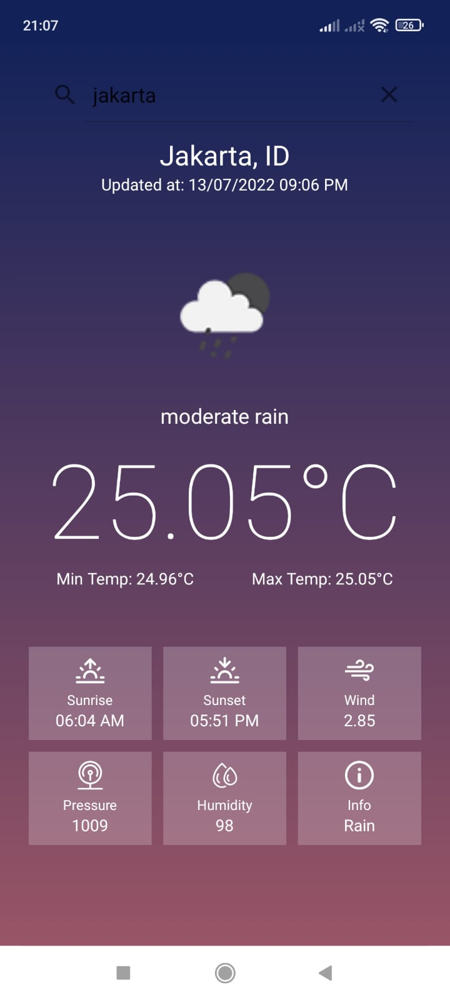
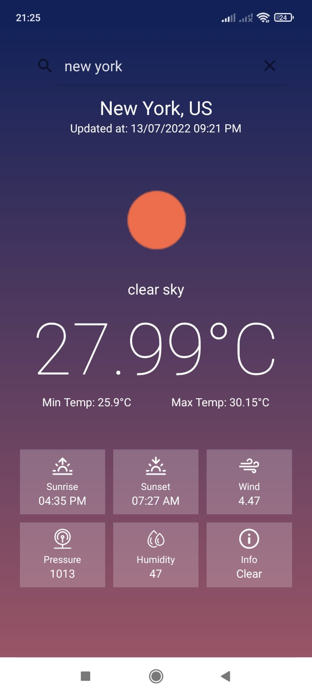

# Simple Weather App - Android

Simple Weather App build with Kotlin, developed using teh APIs offered on [OpenWeatherMap](https://openweathermap.org/api).

## Features

- Networking with [Retrofit](https://square.github.io/retrofit/)
- Adding ViewModels
- Adding LiveData

## Sreenshots
|  |  |   |
| :---:                              | :---:                             | :---:                              |
|   |  |   |

## Trying:

  [Debug apk](https://github.com/fakhrirasyids/WeatherApp-Kotlin/blob/master/app-debug.apk)

## Todo
- Add testing
- Use [Kotlin coroutine](https://github.com/Kotlin/kotlinx.coroutines)
- Fix some problems
